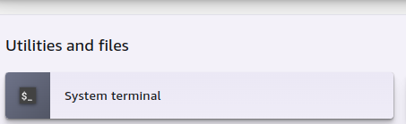

To run on SageMaker studio:
1. Open the System terminal
    
2. ``git clone https://github.com/inorogu/Data-free-backdoor``
3. ``cd Data-free-backdoor``
## Setup
Install the libraries used by the project. 
```bash
pip install -r requirements.txt
```

Substitute Dataset Generation -- download cifar100
```bash
python knowledge_distill_dataset.py
```
Dataset Reduction:
```bash
python data_compression.py
```
Backdoor Injection:
```bash
python poison_model.py
```